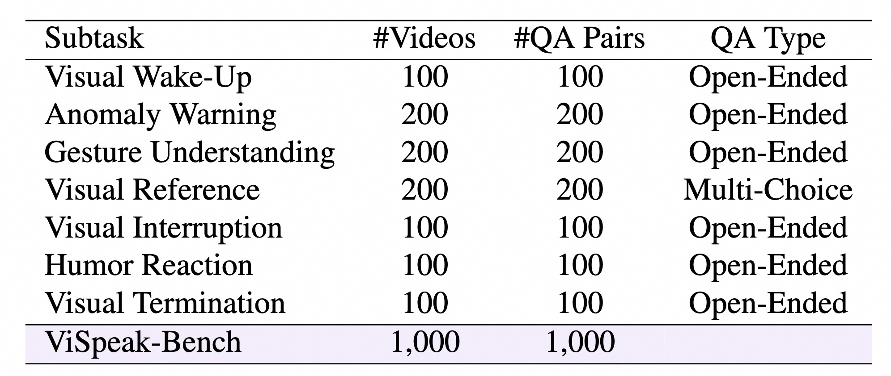
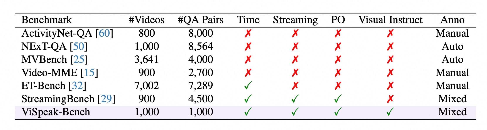
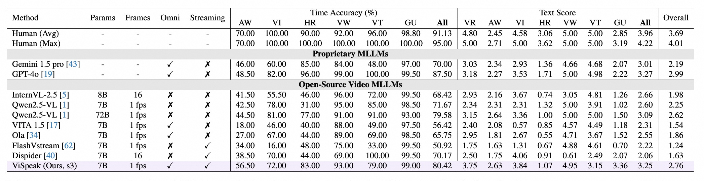

# ViSpeak: Visual Instruction Feedback in Streaming Videos

<div align="center">
  <div style="margin: 30px 0">
    <a href="https://arxiv.org/abs/2503.12769" style="margin: 0 10px">📄 arXiv Paper</a> |
    <a href="https://huggingface.co/datasets/fushh7/ViSpeak-Bench" style="margin: 0 10px">📦 Dataset</a> |
    <a href="https://github.com/HumanMLLM/ViSpeak" style="margin: 0 10px">🔑 Our ViSpeak model and code</a> |
  </div>
</div>


## 🎞️ Overview
This is the official repository for VispeakBench evaluation. In this work, we dive deeper into the interaction characteristic of streaming video understanding and introduce a new task named **Visual Instruction Feedback** to explore the instructions in the visual modality. In this task, we select seven representative subtasks, including: 

- Visual Wake-Up: users use body language to start the conversation
- Anomaly Warning: agents provide in-time warnings or advice based on accidental events
- Gesture Understanding: agents respond to gestures from humans in conversations
- Visual Reference: users use body language to refer to a specific object
- Visual Interruption: users use body language to stop agents speaking
- Humor Reaction: agents share feedback to funny things with users
- Visual Termination: users use body language to end the conversation


### Dataset Statistics

#### 📊 Video Statistic
<div align="center">
  
</div>

#### 🗂️ Comparison with Existing Benchmark
<div align="center">
  
</div>


## 🚂 Evaluation Pipeline

### Requirements

- Python 3.x
- ffmpeg-python
- transformers==4.42.4

For Qwen2.5-VL, we use transformers==4.49.0

### Data Preparation

Download the source video file from [huggingface](https://huggingface.co/datasets/fushh7/ViSpeak-Bench) and put it in the data directory.

```
|--ViSpeak-Bench
|    |--data
|    |  |--annotations
|    |  |--Anomaly_Warning
|    |  |--Gesture_Understanding
|    |  |--Humor_Reaction
|    |  |--Visual_Interrupt
|    |  |--Visual_Reference
|    |  |--Visual_Wake-Up_and_Termination
```


### Inference 
Since most existing Large Video Language Models are offline models, we change the proactive output problems in our ViSpeak-Bench into offline ones following StreamingBench and OVO-Bench.

- In the first step, we will inquire the model whether it is an appropriate time to provide a response iteratively at each timestamp to find an appropriate time for response. The sub-video from the beginning till now is used as if it is a full video. 
- In the second step, the model generates the actual responses based on the context up to now

You can evaluate the benchmark with the following scripts.

```sh
bash eval.sh
```

### Evaluation
This will run the benchmark and save the results to the specified output file. For more details, please refer to our paper.


```sh
## export your openai API and Access Key before evalutation, we use gpt-4o-2024-05-13 as default judge model.
export API=xxxx/chat/completions
export API_KEY=xxxx

bash stats.sh
```

## 🔬 Experimental Results

### Performance of Various MLLMs on ViSpeakBench

<div align="center">
  
</div>


## ✒️ Citation
```bibtex
@article{fu2025vispeak,
  title={ViSpeak: Visual Instruction Feedback in Streaming Videos},
  author={Fu, Shenghao and Yang, Qize and Li, Yuan-Ming and Peng, Yi-Xing and Lin, Kun-Yu and Wei, Xihan and Hu, Jian-Fang and Xie, Xiaohua and Zheng, Wei-Shi},
  journal={arXiv preprint arXiv:2503.12769},
  year={2025}
}
```

## 📝 License
- Our models and code are under the Apache License 2.0.
- But our self-collected videos are under [**CC BY-NC-SA 4.0**](https://creativecommons.org/licenses/by-nc-nd/4.0/) license.